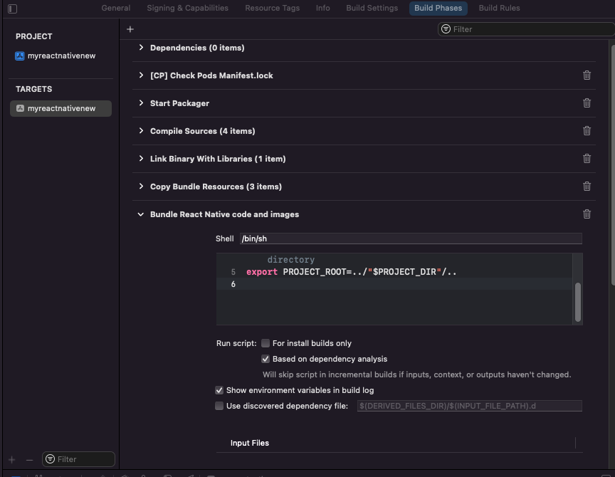
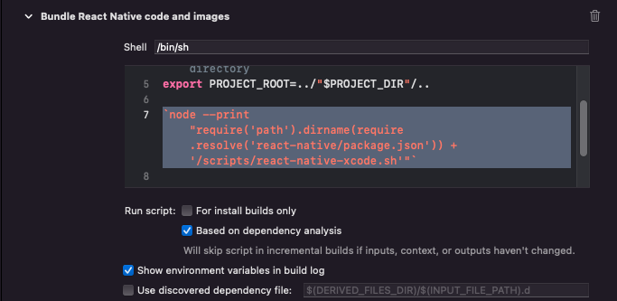
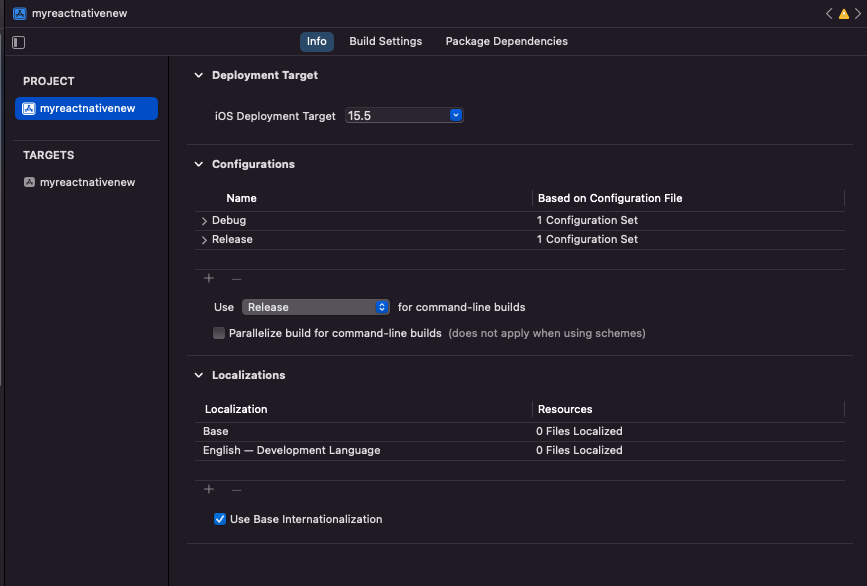

**Steps for Implementing React Native SDK on Physical Devices**

1. Create a react native app from command line. 
	a. Using `create-react-native-app` and Expo 
		- [Use above command and select an expo template](https://reactnative.dev/blog/2017/03/13/introducing-create-react-native-app)
		- Then you will need to build the android and iOS folders in order to run the code on a native device. To do this, you can use 
		- Then run npx react-native run-[platform]
	b. Using `react-native init` 
		- Use the above command like so
        ```
			react-native init YourProjectName
			cd YourProjectName
			react-native run-ios
        ```

**Android** 
Works pretty much out of the box. 

**iOS**
This is where you might run into issues. 

If you do…

1. Open Xcode
2. In your RN project’s iOS directory, open the .xcworkspace file in Xcode
3. Select your project target under “Targets”
    
4. Ensure your signing capabilities are valid and you’re account is registered with apple 
5. Go to Build Phases 
6. Go down to “Bundle React Native Code and images”
    
7. Replace the below code
	export PROJECT_ROOT="$PROJECT_DIR"/..
	`node --print "require('path').dirname(require.resolve('react-native/package.json')) + '/scripts/react-native-xcode.sh'"`
	With: `export PROJECT_ROOT=../"$PROJECT_DIR"/..` 
8. Then, select the .xcodeproj file under “Projects”. 
    
9. Make sure under “Deployment Type” the “iOS Deployment Target” is set to an iOS version that is compatible with the physical device.
10. Select your device at the top of Xcode next to your project
    
11. Then click the play button to build.
12. Once it’s built, in your text editor where you have the project open, run either `expo run:ios` (if using expo template) or `react-native run-ios` (if using `react-native init`). This will start a metro server that the native app will be linked to.